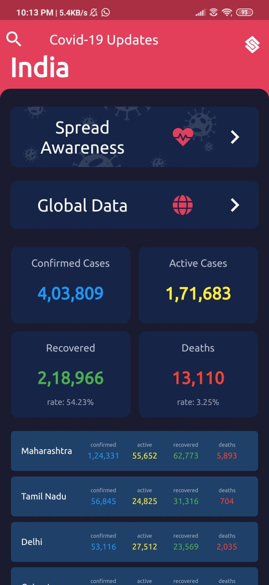
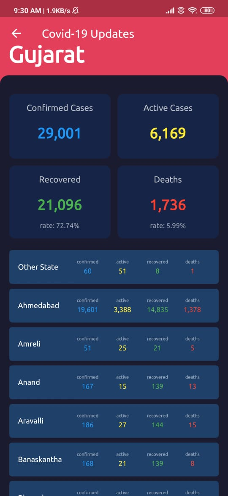
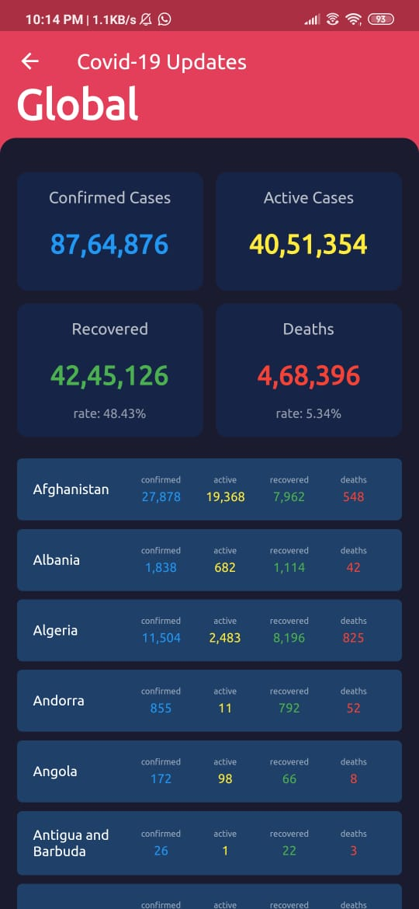
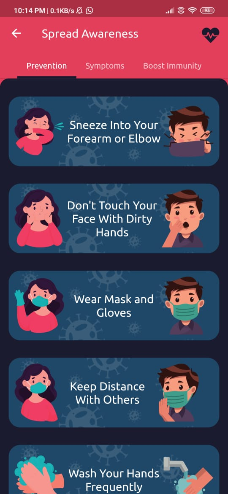
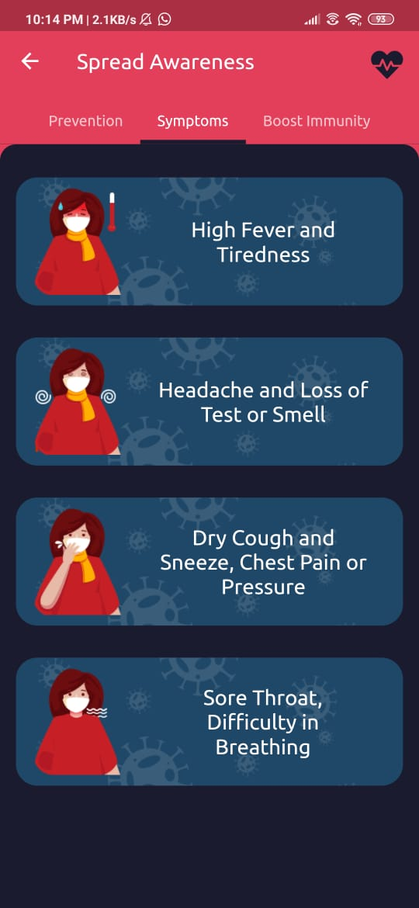

# covid19updates

This simple application is useful to get numeric data of confirmed cases, active cases, recovered case and death tolls statewise and district wise also

The aim of the app is to give latest numerical data of Covid19 Cases at fingertips.

## snapshots
*                
*                 

### Information
* A application which contains widgets displaying total cases enrolled, death toll, recovered cases, and net active cases at present. It displays information regarding every states on this criteria in particular.
* The basic data source that retrieve information which is to be displayed is the api which provides latest and up to date information.This online source updates with all legal declaration and hence provides the most recent data statics till date.
The main problem before considering any information is to check the date of data being uploaded and hence many a times users are deprived of most recent facts. With this application user can scroll through different states and for a demo  the on click event gives widget for a particular state and a scroll down list displaying numeric data regionwise.

## Getting Started

This project is a starting point for a Flutter application.

A few resources to get you started if this is your first Flutter project:

- [Lab: Write your first Flutter app](https://flutter.dev/docs/get-started/codelab)
- [Cookbook: Useful Flutter samples](https://flutter.dev/docs/cookbook)

For help getting started with Flutter, view our
[online documentation](https://flutter.dev/docs), which offers tutorials,
samples, guidance on mobile development, and a full API reference.
