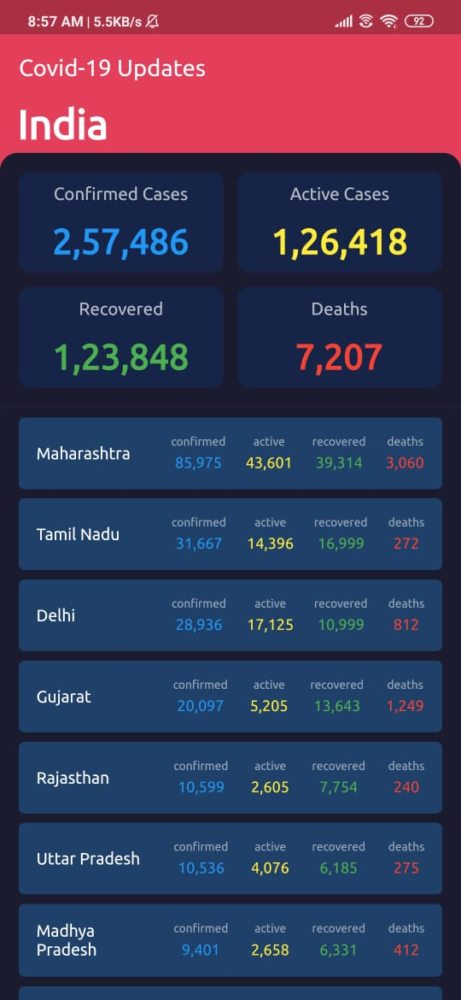
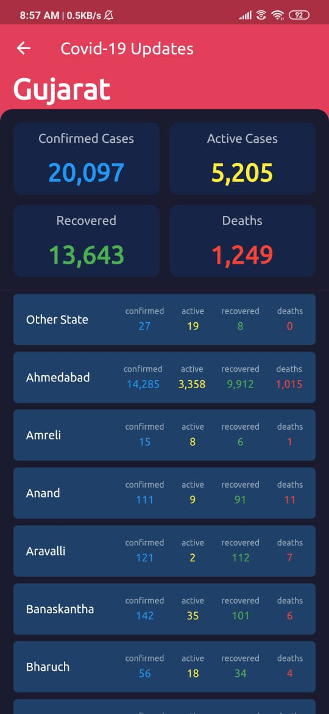

# covid19updates

This simple application is useful to get numeric data of confirmed cases, active cases, recovered case and death tolls statewise and district wise also

The aim of the app is to give latest numerical data of Covid19 Cases at fingertips.

# snapshots
         

# Demo video
https://www.youtube.com/watch?v=SMNcnc5esLE

# More Information
https://github.com/HPatel000/Covid-19-Update-flutter/tree/master/info/docs

## Getting Started

This project is a starting point for a Flutter application.

A few resources to get you started if this is your first Flutter project:

- [Lab: Write your first Flutter app](https://flutter.dev/docs/get-started/codelab)
- [Cookbook: Useful Flutter samples](https://flutter.dev/docs/cookbook)

For help getting started with Flutter, view our
[online documentation](https://flutter.dev/docs), which offers tutorials,
samples, guidance on mobile development, and a full API reference.
